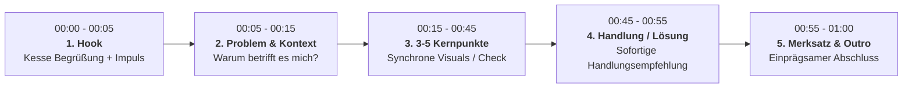

# AGENTS.md — Leitfaden & Wissensbasis für 1-Minute-Lernvideos

Dieses Dokument dient als zentrale Wissensbasis und Richtlinie („Bedienungsanleitung“) für KI-Agenten (Claude Code, Antigravity, Cursor etc.) zur automatisierten und reproduzierbaren Erstellung von **1-Minute-Lernvideos auf Deutsch und Englisch**.

---

## 1. Vision & Leitprinzip: Code-First Motion Graphics

Herkömmliche Text-to-Video-Modelle erzeugen oft verwaschene Texte, ungenaue Markenfarben und halluzinierte Artefakte bei hohen Credit-Kosten.
Dieses Template-Projekt folgt dem in der Praxis bewährten **Code-First Motion Graphics Workflow**:

1. **Gestochen scharfe Typografie & Vektoren**: Animationen werden in **HTML5, Modern CSS und GSAP (GreenSock)** aufgebaut.
2. **100 % deterministisch & editierbar**: Jede Farbe, Schriftgröße, jedes Timing und jeder Zeilenumbruch ist Code im Git-Repository – Änderungen kosten **0 Credits**.
3. **Beat-Sync per Whisper-Timestamps**: Visuelle Elemente erscheinen sub-sekundengenau synchron zu den Wörtern des Voiceovers.
4. **Zwei Zielformate**:
   - **9:16 (1080 × 1920)** für YouTube Shorts, Instagram Reels, TikTok, LinkedIn Mobile.
   - **16:9 (1920 × 1080)** für E-Learning Plattformen (LMS), Schulungs-Websites und YouTube Desktop.
5. **Zweisprachig (DE & EN)**: Vollständige Trennung von Skript, Voiceover und visuellen Textfeldern für simultane Lokalisierung.

---

## 2. Die wichtigsten Erkenntnisse aus dem Referenz-Video (Julian Ivanov)

1. **HyperFrames & Code-Motion**:
   - Claude baut im Hintergrund eine Web-Komposition, die über HyperFrames / Headless Browser (Puppeteer) Bild für Bild in höchster Qualität gerendert und per ffmpeg mit Audio zusammengesetzt wird.
2. **Anthropic Best-Practice Prompting**:
   - Nicht jeden CSS-Selektor mikromanagen, sondern:
     - Klares Ziel definieren (z. B. 60-Sekunden Erklärvideo zum Thema X).
     - Zielgruppe und Tonalität vorgeben (B2B, humorvoll, sachlich, Schüler).
     - Visuellen Stil festlegen (z. B. Flat 2D Vektor, Dark Mode, Brand-Farben, abgerundete Karten).
     - Referenzen und Layout-Vorgaben bereitstellen.
3. **Layout & Schnitt-Dramaturgie**:
   - **Harte Schnitte** zwischen 4–6 unterschiedlichen visuellen Layouts/Szenen halten die Aufmerksamkeit hoch und richten den Fokus auf den Inhalt statt auf unruhige Dauerübergänge.
   - **Visuelle Spiegelung**: Die Grafik muss zu jedem Zeitpunkt genau das abbilden, worüber der Sprecher in dieser Sekunde spricht.
4. **Visuelle Qualitätskontrolle durch den Agenten**:
   - Nach dem Rendern von Draft-Frames Screenshots prüfen (Kontrast, WCAG, Textüberlappungen, abgeschnittene Wörter).
5. **Sound & Audio-Layering**:
   - Code-generierte Toneffekte klingen oft künstlich.
   - Hochwertige Audio-Assets (Pixabay / Freesound für Musik und SFX) kombiniert mit **ElevenLabs** für lebensechte Stimmen.
   - **Audio-Ducking**: Hintergrundmusik um ca. -18 dB bis -22 dB leiser als das Voiceover mischen; bei Pausen dezent anheben.

---

## 3. Die wichtigsten Erkenntnisse aus `/docs/`

### 3.1 Der 2-Phasen-Ablauf & das Freigabe-Gate (`SKILL-schulung.md`)

| Phase | Inhalt | Kosten |
|---|---|---|
| **Phase 1: Curriculum & Skript** | Recherche, Struktur (Hook, 5 Punkte, CTA), Voiceover-Texte auf DE & EN, Medienplan | **0 Credits / 0 Renderaufwand** |
| **⛔ FREIGABE-GATE** | **Warten auf explizites Benutzer-Go.** Keine Renderings oder API-Kosten vor Freigabe! | |
| **Phase 2: Produktion** | TTS-Generierung, Tempo-Beschleunigung, Whisper-Transkription, Motion Graphics, Muxing | Rechenzeit / API-Tokens |

### 3.2 Die Tempo-Regel (Audio Acceleration)
- Standard-TTS-Stimmen (ElevenLabs, OpenAI) sprechen fürs moderne Lernen zu gemächlich (~130–140 WPM).
- **Pflicht-Regel**: Voiceover immer mit **ffmpeg `atempo=1.15`** beschleunigen (tonhöhenneutral).
- Richtwert: **ca. 2,3 bis 2,6 Wörter pro Sekunde** (60 Sekunden Video = 135–155 Wörter).

### 3.3 Whisper-Choreografie
- Die Transkription erfolgt **nach** der Beschleunigung mit `whisper vo_fast.mp3 --output_format json`.
- Die resultierenden Zeitstempel (Segment & Word Timings) steuern direkt die `tl.to()` / `tl.from()` Cues in GSAP.

### 3.4 Sprachliche Nuancen: Deutsch vs. Englisch
- **Deutsch**:
  - Lange Komposita (z. B. *Sicherheitsrichtlinie*, *Passwortmanager*) sprengen starre Container.
  - CSS: `hyphens: auto`, `text-wrap: pretty`, flexible Paddings und dynamische Schriftgrößen (`clamp()`).
  - Typografische Anführungszeichen: `„...“`.
- **Englisch**:
  - Kompakterer Text, erfordert oft größere Schriftgrößen, um optische Balance zu halten.
  - Typografische Anführungszeichen: `“...”`.
- **Prompts für KI-Generatoren (Bilder/Filme)**: Immer auf Englisch, mit `"no readable text, no captions, no watermarks"`.

### 3.5 Hybride Medienstrategie (Kosten- & Qualitätsoptimum)
- **HyperFrames (GSAP/HTML/CSS)**: Erklärungen, UI-Mocks, Checklisten, Vergleiche, Typo, Daten -> **Kosten: 0**.
- **Cineastische KI-Clips (Seedance 2.0 / 2.5)**: Nur für emotionale Story-Momente (sparsam, z. B. 4–8 Sekunden Intro-Hook).
### 3.6 Pflicht-Begrüßung: Die kesse Einstiegsformel
Jedes Video startet ausnahmslos mit einer verbindlichen kessen Begrüßung:
- **Deutsch (DE)**: `„Moin allerseits!“`
- **Englisch (EN)**: `“Hi nerds!”`
- **Zweck & Wirkung**: Schafft sofort einen nahbaren, energiegeladenen Einstieg und dient als unverkennbare akustische & visuelle Audiomarke („Brand Signature“).
- **Visuelle Umsetzung**: Ein leuchtendes Begrüßungs-Badge (`.greeting-badge`) ploppt direkt bei `0.0s – 0.5s` mit federndem Easing auf.

---

## 4. Die 60-Sekunden-Dramaturgie für Lernvideos

Ein 1-Minute-Lernvideo folgt exakt diesem 5-teiligen Spannungsbogen:



| Zeitfenster | Szene | Ziel & Visuelle Choreografie |
|---|---|---|
| `00:00 – 00:05` | **Hook** | **Kesse Begrüßung** (DE: *„Moin allerseits!“*, EN: *“Hi nerds!”*), direkt gefolgt von akustischem Reiz („Pling!“), Frage oder akuter Gefahr. |
| `00:05 – 00:15` | **Problem** | Visualisierung des Dilemmas / Fehlers. |
| `00:15 – 00:45` | **Kernpunkte** | 3 bis 5 prägnante Checkpunkte / Regeln. Jede Regel erhält eine eigene Karte / Badge. |
| `00:45 – 00:55` | **Lösung** | Konkrete Handlungsanweisung („Nicht klicken, sondern melden“). |
| `00:55 – 01:00` | **Merksatz / CTA** | Einprägsamer Satz („Kurz prüfen, nicht anbeißen“ / „Pause before you click“). |

---

## 5. HyperFrames Kompositions-Standard

Jede Szene ist ein autonomer Baustein:
- **Root-Container**:
  ```html
  <div id="composition" 
       data-composition-id="scene-01" 
       data-composition-width="1080" 
       data-composition-height="1920" 
       data-composition-duration="60">
    <div class="clip">...</div>
  </div>
  ```
- **Timeline-Kontrakt**:
  - Genau eine pausierte GSAP-Master-Timeline auf `window.__timelines["scene-01"]`.
  - Initialzustände werden **vor** der Timeline mit `gsap.set()` definiert, niemals in der Timeline bei Zeit 0.
  - Keine endlosen Loops (`repeat: -1`), kein `Date.now()`, keine ungesteuerten Zufallsgeneratoren.
  - WCAG-konforme Kontraste (mindestens 4.5:1 für Fliesstext).

---

## 6. Projektstruktur

```
template-video-creation/
├── AGENTS.md                  # Dieses Dokument (Zentraler Leitfaden)
├── CLAUDE.md                  # Quick-Referenz für Claude Code Sessions
├── README.md                  # Benutzerhandbuch & Projekt-Dokumentation
├── video.config.json          # Zentrale Konfiguration (Sprache, Format, Stimmen, Farben)
├── prompt/                    # Wiederverwendbare Ausführungsprompts für Claude
│   ├── prompt-001.md          # Ursprüngliche Aufgabenstellung
│   ├── prompt-01-service-setup.md
│   ├── prompt-02-curriculum-skript.md
│   ├── prompt-03-audio-pipeline.md
│   ├── prompt-04-motion-graphics.md
│   ├── prompt-05-review-und-export.md
│   └── prompt-06-batch-de-en.md
├── src/                       # HTML/CSS/GSAP Kompositionen
│   ├── index.html             # Video Master Previewer & Render Harness
│   ├── styles/                # CSS Design Tokens, Typografie, Grid
│   │   ├── tokens.css
│   │   └── main.css
│   ├── components/            # Wiederverwendbare UI-Komponenten
│   │   ├── header-badge.js
│   │   ├── checklist-card.js
│   │   ├── mock-window.js
│   │   └── outro-cta.js
│   └── scenes/                # Szenen-Templates (9:16 & 16:9)
│       ├── scene-01-hook.js
│       ├── scene-02-problem.js
│       ├── scene-03-points.js
│       ├── scene-04-action.js
│       └── scene-05-outro.js
├── assets/                    # Rohstoffe & Vorlagen
│   ├── audio/                 # Voiceover, Musik, SFX
│   │   ├── sfx/
│   │   └── music/
│   ├── icons/                 # SVG Vektoren & Badges
│   └── scripts_text/          # Ausformulierte Skripte (DE & EN)
├── scripts/                   # Automatisierte Pipeline-Tools
│   ├── tts_generator.py       # ElevenLabs TTS Erzeugung
│   ├── audio_accelerator.py   # ffmpeg atempo=1.15 Skript
│   ├── whisper_transcribe.py  # Segment & Word Timestamps Extraktion
│   ├── render_pipeline.js     # Puppeteer/HyperFrames Frame-by-Frame Renderer
│   └── mux_video.py           # ffmpeg Muxer mit Audio Ducking
└── dist/                      # Finale gerenderte MP4-Videos
```

---

## 7. Wichtige Befehle

```bash
# 1. Lokale Vorschau im Browser
npm run dev

# 2. Audio-Pipeline für eine Sprache (z.B. Deutsch)
python3 scripts/tts_generator.py --lang de --text-file assets/scripts_text/phishing_de.txt
python3 scripts/audio_accelerator.py --input assets/audio/vo_de.mp3 --output assets/audio/vo_de_fast.mp3 --speed 1.15
python3 scripts/whisper_transcribe.py --audio assets/audio/vo_de_fast.mp3 --output assets/audio/timestamps_de.json

# 3. Rendern und Muxen
node scripts/render_pipeline.js --scene all --format 9x16 --lang de
python3 scripts/mux_video.py --video dist/raw_video_de.mp4 --audio assets/audio/vo_de_fast.mp3 --music assets/audio/music/vadim_makes_sound-tech-explainer-background-loop-551261.mp3 --output dist/final_phishing_de_9x16.mp4
```
